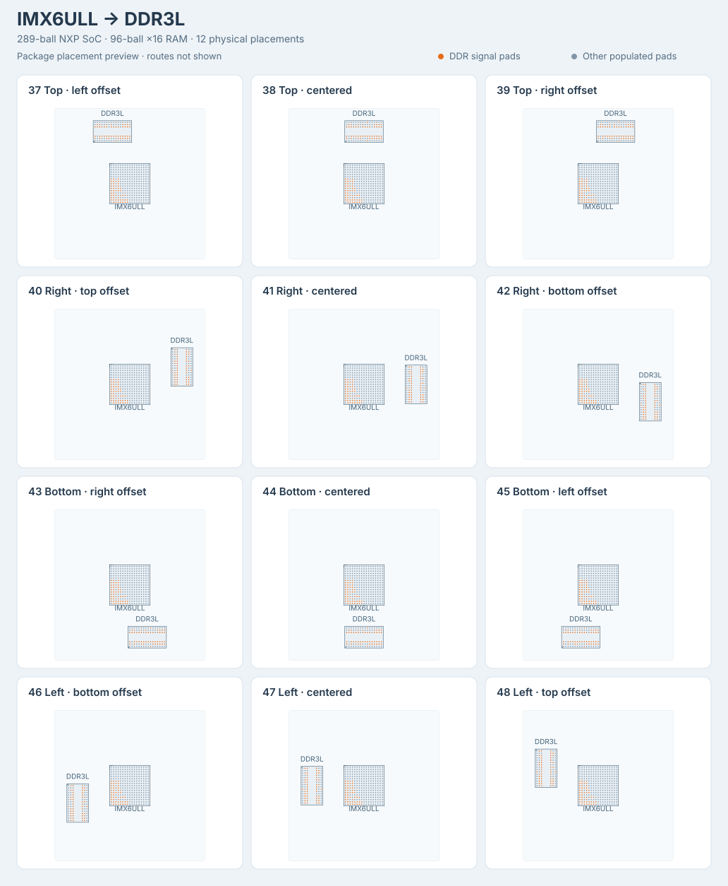
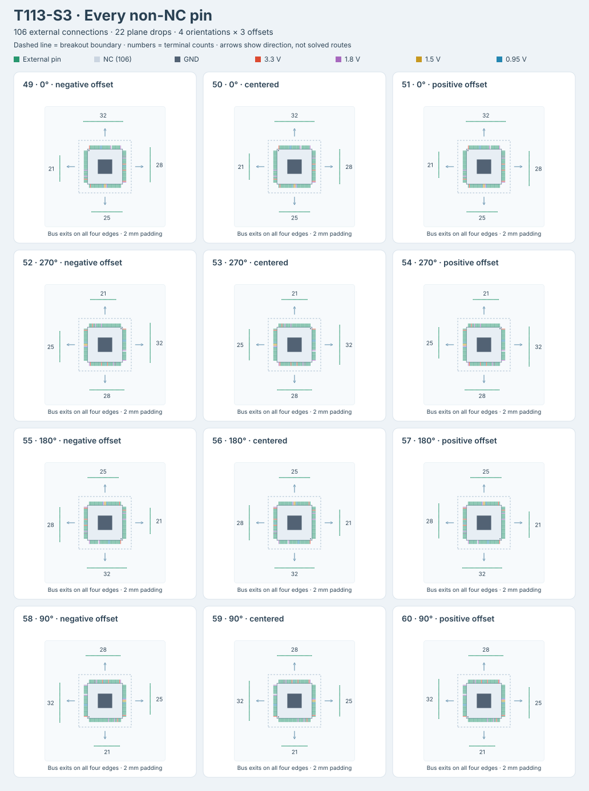

# dataset-fanout31-am62l

Sixty TSX-generated BGA/QFP fanout problems: twelve AM62L, twelve
Rockchip RK3308-to-DDR3L, twelve Canaan K230-to-LPDDR4, and twelve
NXP i.MX 6ULL-to-DDR3L, plus twelve Allwinner T113-S3 all-pin configurations.
The package name and existing IDs 01-48 remain stable. T113-S3 uses
IDs 49-60 and separate exports.

| Sample family | SoC package | Signal connections | Plane drops | Total connections | Buses | Physical pads |
| --- | --- | ---: | ---: | ---: | ---: | ---: |
| AM62L, 01-12 | AM62L32BOGHAANBR, 373 balls | 33 | 102 | 135 | 111 | 573 |
| RK3308, 13-24 | RK3308, 355 balls | 49 | 113 | 162 | 122 | 451 |
| K230, 25-36 | K230, 390 balls | 65 | 106 | 171 | 123 | 790 |
| i.MX 6ULL, 37-48 | MCIMX6Y2CVM08AB, 289 balls | 49 | 53 | 102 | 62 | 385 |
| T113-S3, 49-60 | T113-S3, 128 leads + EPAD | 106 | 22 | 128 | 60 | 235 |

Each family covers all twelve canonical directional edge positions in
`@tscircuit/fanout-solver`:

- majority up: top edge, left/center/right bands
- majority right: right edge, top/center/bottom bands
- majority down: bottom edge, right/center/left bands
- majority left: left edge, bottom/center/top bands

Every problem has a source circuit in `samples/*.tsx` and an independently
selectable `pages/*.page.tsx` React Cosmos fixture.

## Rockchip RK3308 and DDR3L


Regenerate the placement preview with `bun scripts/generate-rk3308-preview.ts`.
The orange pads are DDR signals; routes are not shown in this overview.

The original RK3308 provides an external 16-bit DDR interface in a
355-ball TFBGA package: 13 x 13 mm body, 0.65 mm pitch, and 45 empty sites in
its 20 x 20 ball grid. The complete occupied-ball map is recorded in
[`lib/rk3308-ball-map.ts`](lib/rk3308-ball-map.ts). Coordinates use the top
PCB view, with A1 at the upper left. Package geometry and ball functions
come from the [Rockchip RK3308 datasheet Rev. 1.0](https://dl.radxa.com/rockpis/docs/hw/datasheets/Rockchip%20RK3308%20Datasheet%20V1.0-2018027.pdf),
sections 2.3-2.5, printed pages 16-26. The 106 digital ground balls use
Table 2-1, whose assignments agree with the
[Radxa ROCK Pi S v1.0 schematic](https://dl.radxa.com/rockpis/docs/hw/ROCK-PI-S_v10_sch_20190323.pdf);
the datasheet's Table 2-2 ground summary contains inconsistent ball names.
The RK3308G variant, which embeds RAM, is not used.

RAM is a Samsung `K4B4G1646E-BYMA`: 4 Gb (512 MiB), organized as 256M x16
DDR3L, in a 96-ball FBGA with 0.8 mm pitch and a 7.5 x 13.3 mm body.
Its pinout and dimensions follow the
[Samsung datasheet Rev. 1.0, December 2014](https://files.iczoom.com/hjiczoom/images/public/basicproduct/1476762220150_K4B4G1646E.pdf),
sections 1 and 3.1-3.2, printed pages 5-7. This is a mirror of the
manufacturer-authored datasheet. The package has sixteen rows and six
populated columns (1-3 and 7-9).

All 49 DDR signals connect matching logical functions between the two
packages, without byte or address swaps: 16 data, 2 masks, 4 data strobes,
15 addresses, 3 bank addresses, 2 clocks, and 7 control/reset signals.
They form nine signal buses and three differential pairs. A further 106
`VSS` and 7 `DDR_VDD` balls form single-connection plane-drop buses. All
355 SoC pads and 96 RAM pads remain in the captured obstacle set.

The SoC stays at the origin while the RAM moves physically to each side.
Its center is 18 mm away along the selected axis, with lateral offsets of
-6, 0, or +6 mm for the three bands. RAM rotates 90 degrees for top/bottom
placements and remains at 0 degrees for left/right placements. Its
breakout faces the SoC. These twelve placements are generated by
[`lib/create-rk3308-fanout-sample.tsx`](lib/create-rk3308-fanout-sample.tsx).
The 24-wire address/control bus uses the center band of the selected
edge in every case; the byte and narrower signal buses shift across
the edge bands. Both breakout regions use 3.5 mm padding.

All families use eight layers. RK3308 digital ground drops terminate on
`inner1`, DDR supply drops on `inner2`, and signal routing uses `top`,
`inner4`, `inner5`, `inner6`, and `bottom`. The RK3308 and RAM copper land
diameters are dataset choices of 0.30 mm and 0.40 mm, respectively. These
values describe copper lands; Samsung specifies nominal 0.50 mm solder
balls. The RAM land size follows the
0.8 mm-pitch pattern in the
[KiCad footprint library](https://github.com/KiCad/kicad-footprints/blob/master/Package_BGA.pretty/BGA-96_9.0x13.0mm_Layout2x3x16_P0.8mm.kicad_mod),
while its outline follows the Samsung body dimensions. Length-skew budgets
of 8 mm for each data byte, 15 mm for address/control, and 0.25 mm for each
differential pair are fanout benchmark constraints, not board-level DDR
timing signoff limits.

## Canaan K230 and two LPDDR4 channels


Regenerate the placement preview with `bun scripts/generate-k230-preview.ts`.
The overview shows physical packages and signal pads, without solved routes.

K230 is listed as C21264502 on the
[NPU chip list](https://jlcsearch.tscircuit.com/npu_chips/list). The external-memory
K230 uses a 390-ball VFBGA package: 13 x 13 mm body, 0.65 mm pitch, and ten
empty sites in a 20 x 20 grid. Its complete occupied-ball map and LPDDR4
functions are in [`lib/k230-ball-map.ts`](lib/k230-ball-map.ts), sourced from
Canaan's [pinout workbook v1.2, August 2024](https://kendryte-download.canaan-creative.com/developer/k230/HDK/K230%E7%A1%AC%E4%BB%B6%E6%96%87%E6%A1%A3/K230_PINOUT_V1.2_20240822.xlsx).
Coordinates follow the manufacturer's top view: row A is at the top and
column 1 is on the left; A1 itself is unpopulated. The workbook corrects
DDR descriptions from earlier hardware-guide figures, so the dataset uses
its newer LPDDR4 aliases rather than the LPDDR3 names on the same balls.
The K230D variant with embedded RAM is not used.

Two Micron `MT53E256M16D1FW-046 AIT:B` packages provide one single-rank
x16 LPDDR4 channel each, following the two-device topology in Canaan's
[hardware guide](https://github.com/kendryte/k230_docs/blob/main/en/00_hardware/K230_Hardware_Design_Guide.md#lpddr4).
Each package is 4 Gb (512 MiB), for 1 GiB total, within K230's documented
2 GB maximum in its [datasheet](https://github.com/kendryte/k230_docs/blob/main/zh/00_hardware/K230_datasheet.md#memory).
The density, single-channel organization, complete 200-ball map, and
10 x 14.5 mm package geometry follow Table 3 and Figures 2, 4, and 7 of
the [Micron-authored datasheet, Rev. F, October 2020](https://datasheet.lcsc.com/datasheet/pdf/cafc8b028f5fedc321cc6d079eead257.pdf?productCode=C5330485).
The horizontal and vertical pitches are 0.8 mm and 0.65 mm. These are
signal-compatible fixture choices, without a claim that Canaan qualified
the exact ordering code.

Each channel retains 16 data bits, two masks, four strobe wires, six
command/address bits, one clock pair, CS0, and CKE0. A single SoC `RESET_N`
net connects J16 to T11 on both RAMs. The unused rank-one chip-select and
clock-enable pads remain obstacles. There are no byte or address swaps.
The resulting 65 signal connections form 17 buses and six differential
pairs. Another 101 digital `VSS` and five `VDDIO_DDR` connections form
106 individual plane-drop buses. Every capture retains all 390 SoC pads
and both sets of 200 RAM pads: 171 connections, 123 buses, and 790 obstacles.

The SoC remains at the origin. The RAM pair's center moves 26 mm toward
the selected side and -6, 0, or +6 mm along it; each RAM is another 12 mm
from that center in the transverse direction. Both RAMs rotate 90 degrees
for top/bottom placements and remain unrotated for left/right placements.
These twelve configurations are generated by
[`lib/create-k230-fanout-sample.tsx`](lib/create-k230-fanout-sample.tsx).
The SoC breakout uses 8 mm padding, giving the busiest corner band enough
space for 43 via-safe exits. Each RAM has a separate breakout with 3.5 mm
padding. All three regions remain disjoint, and the shared reset retains
both downstream RAM endpoints. Core supplies the boundary targets; a
multicast reset may omit the optional single-destination target guidance.

K230 signals use `top`, `inner4`, `inner5`, `inner6`, and `bottom` on an
eight-layer board. Digital ground drops terminate on `inner1` and DDR I/O
supply drops on `inner2`. The SoC's 0.30 mm circular copper lands are a
dataset choice; the RAM's 0.40 mm lands follow the SMD board-pad dimension
in Micron's package drawing. These are distinct from solder-ball sizes.
Through vias have 0.24 mm pads and 0.10 mm holes; via-in-pad and blind/buried
vias are disabled. As with the RK3308 fixtures, skew budgets are 8 mm for
data bytes, 15 mm for command/control, and 0.25 mm for differential pairs.
These budgets apply to the fanout benchmark, not board-level timing signoff.

## NXP i.MX 6ULL and DDR3L



The [JLCPCB C414042 part](https://jlcpcb.com/partdetail/MCIMX6Y2CVM08AB/C414042)
is NXP `MCIMX6Y2CVM08AB`, an i.MX 6ULL in the 14 x 14 mm,
0.8 mm-pitch MAPBGA289 package. It has a fully populated 17 x 17 grid.
The complete ball map in [`lib/imx6ull-ball-map.ts`](lib/imx6ull-ball-map.ts)
follows NXP's [IMX6ULLIEC Rev. 1.2, November 2017](https://www.nxp.com/assets/documents/data/en/data-sheets/IMX6ULLIEC.pdf),
Table 1 and Figure 70 / Tables 90-92 (printed pages 112-124). Coordinates
use the top PCB view, A1 upper left. All 289 pads remain obstacles; circular
0.40 mm copper lands are a dataset choice, distinct from the specified
0.35-0.45 mm solder-ball diameter.

The family reuses the Samsung `K4B4G1646E-BYMA` 4 Gb x16 DDR3L fixture
described above. All 49 connections preserve logical bit numbers and
polarity: 16 data, 15 address, three bank-address, two masks, four strobe,
two clock, and seven control/reset wires. These form nine signal buses
and three differential pairs. The unused rank-one controls (`CS1_B`,
`SDCKE1`, `ODT1`) and A15 remain obstacles. ZQ calibration, VREF,
`NVCC_DRAM_2P5`, and `NGND_KEL0` are outside the signal/plane-drop fixture.
The 47 `VSS` balls drop to `inner1`; the six `NVCC_DRAM` balls drop to
`inner2`. This gives 102 connections, 62 buses, and 385 physical pads.

RAM placement, eight-layer routing rules, 3.5 mm breakout padding, and
benchmark skew budgets follow the RK3308 family. RAM moves 18 mm toward
each side with -6/0/+6 mm offsets and rotates 90 degrees at the top/bottom.
The 24-wire address/control bus stays centered; other buses shift with
the selected band. These fixtures score SoC escape routes, with full
board routing disabled; they do not provide DDR timing signoff or a
complete powered board.

Regenerate the overview with `bun scripts/generate-imx6ull-preview.ts`.
Run this family with `bun run solve-count --chip imx6ull`.

## Allwinner T113-S3: every non-NC pin



[T113-S3 / JLCPCB C5197687](https://jlcpcb.com/partdetail/AllwinnerTech-T113S3/C5197687)
contains its DDR3 RAM internally. These twelve cases break out **every external
pin except NC0 (pin 106)**, including the exposed ground pad as logical pin
129. Each case contains 106 external signal/reference/regulator-output
connections and 22 supply/ground plane drops. All 129 SoC pads, including
NC0, remain obstacles, alongside 106 individual destination pads.
The destination bank represents external terminals, not another RAM chip.

[`lib/t113s3-pin-map.ts`](lib/t113s3-pin-map.ts) follows Table 4-2 of
Allwinner's [T113-S3 datasheet v1.6, March 3, 2022](https://datasheet.lcsc.com/datasheet/pdf/a431990106c90c1e37535402cd34f7c4.pdf?productCode=C5197687)
(printed pp. 23-28). This manufacturer-authored document is hosted by LCSC.
Use that table rather than Figure 7-1, whose DZQ/PD/PG labels conflict with
it. The assignments and EPAD ground connection are independently checked
against U9 on sheet 3 of the
[TinyEmbedded-Dual-A schematic](https://github.com/yuansco/TinyEmbedded-Dual/blob/main/Document/TinyEmbedded_Dual_A.pdf).

The eLQFP128 footprint uses a 14 x 14 mm body, 0.4 mm lead pitch, and the
**5.72 x 5.72 mm exposed pad** explicitly selected in Figure 7-2's caution.
Pin numbering is counterclockwise in the top PCB view, pin 1 at the upper
left. The 1.50 x 0.20 mm perimeter lands centered 7.70 mm from the origin
are fixture geometry choices; the package's nominal lead-tip span is 16 mm.

The fixture selects external power supplies and 3.3 V GPIO D/E/G banks.
The following assignments use Table 5-2's recommended operating voltages:

| Plane net | Layer | Connected pins |
| --- | --- | --- |
| GND | inner1 | AGND 91, EPAD 129 |
| 3.3 V | inner2 | LDO-IN 29, VCC-PE 34, VCC-PD 66, VCC-TVOUT 77, VCC-IO 83, VCC-PG 128 |
| 1.8 V | inner3 | VCC-PLL 20, VCC-RTC 26, VDD18-DRAM 50, VCC-LVDS 65, AVCC 89, HPVCC 97, VCC-TVIN 107 |
| 1.5 V DRAM | inner4 | VCC-DRAM0 48, VCC-DRAM1 49 |
| 0.95 V core/system | inner5 | VDD-SYS0 46, VDD-SYS1 51, VDD-SYS2 81, VDD-CORE0 116, VDD-CORE1 117 |

Each plane net occupies a separate copper layer. Signals use `top`, `inner6`,
and `bottom`. LDOA-OUT 28 and LDOB-OUT 30 have independent external terminals;
they are not tied to the externally driven power rails. In particular,
LDOB defaults to 1.35 V, so it must not be shorted to the 1.5 V DRAM supply.
TVIN-VRP/VRN 110/111, VRA1/VRA2 92/90, HPOUTFB 100, DZQ 47, and the crystal
pins also remain distinct external connections. Their external decoupling,
calibration resistors, crystals, rail filtering, and power sequencing are
outside this escape-routing dataset.

Seven GPIO groups preserve the physical banks (PD is split into 0-9 and
10-22). USB0, USB1, and MICIN3 preserve their fixed differential polarities;
the remaining 28 connections use individual buses. This gives 38 boundary
buses plus 22 single-pin plane buses. GPIO multiplex functions are not
assumed, so alternative LVDS/DSI/RGB assignments are not simultaneously
wired. A 0.25 mm skew budget on the three fixed pairs is a benchmark
constraint, not interface timing signoff.

The SoC stays at the origin; a two-row, 0.8 mm-pitch terminal bank moves
40 mm to the selected side and -8/0/+8 mm along it. It rotates 90 degrees
for left/right placements. The SoC breakout uses 14 mm padding to provide
space for 106 exits, and buses cycle through the three bands along the
selected edge. Core supplies all boundary coordinates. Only the SoC fanout
is routed; the external-terminal breakout and subsequent board routing
are disabled. Through vias use 0.24 mm lands and 0.10 mm holes, with
via-in-pad and blind/buried vias disabled.

Regenerate the overview with `bun scripts/generate-t113s3-preview.ts`.
Run this family with `bun run solve-count --chip t113s3`.

## Fanout fixture scope

The RAM-family TSX describes actual SoC-to-RAM connectivity and requests boundary
directions through `<breakout>` groups. Core's implicit winding
solver places the `AutoplacedBreakoutPoint`s; the dataset captures the
exact SoC `FanoutSolver` constructor arguments after that pass. Individual breakout-point
coordinates are not supplied by the sample files. Each case is displayed
through `GenericSolverDebugger` in the exported React Cosmos site.

These are SoC escape-routing fixtures. The scored routes end at the SoC
breakout boundary, and board routing between the packages is disabled.
They do not model a complete working board. The RAM families omit other
SoC interfaces, analog grounds/supplies, and RAM power/reference connections.
T113-S3 includes every non-NC external pin as described above. External
decoupling, termination, and power-generation circuitry are outside all
these escape-routing workloads.

The AM62L footprint, signal assignments, preferred layers, length-skew
limits, differential pairs, GND/VDDS_DDR plane drops, and plane-drop
directions retain the fixture behind
`tscircuit/core/tests/repros/repro-am62l-lpddr4-progressive-fanout.test.tsx`.
The two DMI buses come from its RAM-above variant, making the original
family a superset of that fixture's default seven-signal-bus test.

## Development

```sh
bun install
bun run start
bun test
bun run typecheck
bun run format:check
bun run build:site
```

`solve-count` reports the measured solver success count with a 60-second
timeout per sample in a family run. With no arguments it runs all 60
samples; use `--chip` to select a family:

```sh
bun run solve-count
bun run solve-count --chip am62l
bun run solve-count --chip rk3308
bun run solve-count --chip k230
bun run solve-count --chip imx6ull
bun run solve-count --chip t113s3
bun run solve-count --sample 13-rk3308-top-left-offset
bun run solve-count --sample 25-k230-top-left-offset
```

`FANOUT_SAMPLE_TIMEOUT_MS` overrides the timeout for family runs. A
`--sample` invocation runs directly and returns one JSON result. Legacy
exit selectors such as `--sample topside_left` still select AM62L unless
`--chip rk3308`, `--chip k230`, `--chip imx6ull`, or `--chip t113s3` is supplied.
