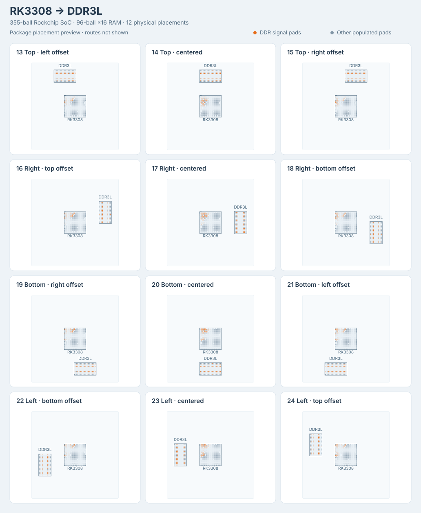

# dataset-fanout31-am62l

Twenty-four TSX-generated BGA fanout problems: the original twelve AM62L
samples and twelve Rockchip RK3308-to-DDR3L samples. The package name,
original sample IDs 01-12, and AM62L exports remain stable; RK3308 uses IDs
13-24 and separate exports.

| Sample family | SoC package | Signal connections | Plane drops | Total connections | Buses | Physical pads |
| --- | --- | ---: | ---: | ---: | ---: | ---: |
| AM62L, 01-12 | AM62L32BOGHAANBR, 373 balls | 33 | 102 | 135 | 111 | 573 |
| RK3308, 13-24 | RK3308, 355 balls | 49 | 113 | 162 | 122 | 451 |

Each family covers all twelve canonical directional edge positions in
`@tscircuit/fanout-solver`:

- majority up: top edge, left/center/right bands
- majority right: right edge, top/center/bottom bands
- majority down: bottom edge, right/center/left bands
- majority left: left edge, bottom/center/top bands

Every problem has a source circuit in `samples/*.tsx` and an independently
selectable `pages/*.page.tsx` React Cosmos fixture.

## Rockchip RK3308 and DDR3L



Regenerate the placement preview with `bun scripts/generate-rk3308-preview.ts`.
The orange pads are DDR signals; routes are not shown in this overview.

The original RK3308 provides an external 16-bit DDR interface in a
355-ball TFBGA package: 13 x 13 mm body, 0.65 mm pitch, and 45 empty sites in
its 20 x 20 ball grid. The complete occupied-ball map is recorded in
[`lib/rk3308-ball-map.ts`](lib/rk3308-ball-map.ts). Coordinates use the top
PCB view, with A1 at the upper left. Package geometry and ball functions
come from the [Rockchip RK3308 datasheet Rev. 1.0](https://dl.radxa.com/rockpis/docs/hw/datasheets/Rockchip%20RK3308%20Datasheet%20V1.0-2018027.pdf),
sections 2.3-2.5, printed pages 16-26. The 106 digital ground balls use
Table 2-1, whose assignments agree with the
[Radxa ROCK Pi S v1.0 schematic](https://dl.radxa.com/rockpis/docs/hw/ROCK-PI-S_v10_sch_20190323.pdf);
the datasheet's Table 2-2 ground summary contains inconsistent ball names.
The RK3308G variant, which embeds RAM, is not used.

RAM is a Samsung `K4B4G1646E-BYMA`: 4 Gb (512 MiB), organized as 256M x16
DDR3L, in a 96-ball FBGA with 0.8 mm pitch and a 7.5 x 13.3 mm body.
Its pinout and dimensions follow the
[Samsung datasheet Rev. 1.0, December 2014](https://files.iczoom.com/hjiczoom/images/public/basicproduct/1476762220150_K4B4G1646E.pdf),
sections 1 and 3.1-3.2, printed pages 5-7. This is a mirror of the
manufacturer-authored datasheet. The package has sixteen rows and six
populated columns (1-3 and 7-9).

All 49 DDR signals connect matching logical functions between the two
packages, without byte or address swaps: 16 data, 2 masks, 4 data strobes,
15 addresses, 3 bank addresses, 2 clocks, and 7 control/reset signals.
They form nine signal buses and three differential pairs. A further 106
`VSS` and 7 `DDR_VDD` balls form single-connection plane-drop buses. All
355 SoC pads and 96 RAM pads remain in the captured obstacle set.

The SoC stays at the origin while the RAM moves physically to each side.
Its center is 18 mm away along the selected axis, with lateral offsets of
-6, 0, or +6 mm for the three bands. RAM rotates 90 degrees for top/bottom
placements and remains at 0 degrees for left/right placements. Its
breakout faces the SoC. These twelve placements are generated by
[`lib/create-rk3308-fanout-sample.tsx`](lib/create-rk3308-fanout-sample.tsx).
The 24-wire address/control bus uses the center band of the selected
edge in every case; the byte and narrower signal buses shift across
the edge bands. Both breakout regions use 3.5 mm padding.

Both families use eight layers. RK3308 digital ground drops terminate on
`inner1`, DDR supply drops on `inner2`, and signal routing uses `top`,
`inner4`, `inner5`, `inner6`, and `bottom`. The RK3308 and RAM copper land
diameters are dataset choices of 0.30 mm and 0.40 mm, respectively. These
values describe copper lands; Samsung specifies nominal 0.50 mm solder
balls. The RAM land size follows the
0.8 mm-pitch pattern in the
[KiCad footprint library](https://github.com/KiCad/kicad-footprints/blob/master/Package_BGA.pretty/BGA-96_9.0x13.0mm_Layout2x3x16_P0.8mm.kicad_mod),
while its outline follows the Samsung body dimensions. Length-skew budgets
of 8 mm for each data byte, 15 mm for address/control, and 0.25 mm for each
differential pair are fanout benchmark constraints, not board-level DDR
timing signoff limits.

## Fanout fixture scope

The TSX describes actual SoC-to-RAM connectivity and requests boundary
directions through paired `<breakout>` groups. Core's implicit winding
solver places the `AutoplacedBreakoutPoint`s; the dataset captures the
exact SoC `FanoutSolver` constructor arguments after that pass. Breakout
coordinates are not supplied by the sample files. Each case is displayed
through `GenericSolverDebugger` in the exported React Cosmos site.

These are SoC escape-routing fixtures. The scored routes end at the SoC
breakout boundary, and board routing between the packages is disabled.
They do not model a complete working board: other SoC interfaces, analog
grounds and supplies, RAM power/reference connections, decoupling, and
termination circuitry are outside this workload.

The AM62L footprint, signal assignments, preferred layers, length-skew
limits, differential pairs, GND/VDDS_DDR plane drops, and plane-drop
directions retain the fixture behind
`tscircuit/core/tests/repros/repro-am62l-lpddr4-progressive-fanout.test.tsx`.
The two DMI buses come from its RAM-above variant, making the original
family a superset of that fixture's default seven-signal-bus test.

## Development

```sh
bun install
bun run start
bun test
bun run typecheck
bun run format:check
bun run build:site
```

`solve-count` reports the measured solver success count with a 60-second
timeout per sample in a family run. With no arguments it runs all 24
samples; use `--chip` to select a family:

```sh
bun run solve-count
bun run solve-count --chip am62l
bun run solve-count --chip rk3308
bun run solve-count --sample 13-rk3308-top-left-offset
```

`FANOUT_SAMPLE_TIMEOUT_MS` overrides the timeout for family runs. A
`--sample` invocation runs directly and returns one JSON result. Legacy
exit selectors such as `--sample topside_left` still select AM62L unless
`--chip rk3308` is supplied.
