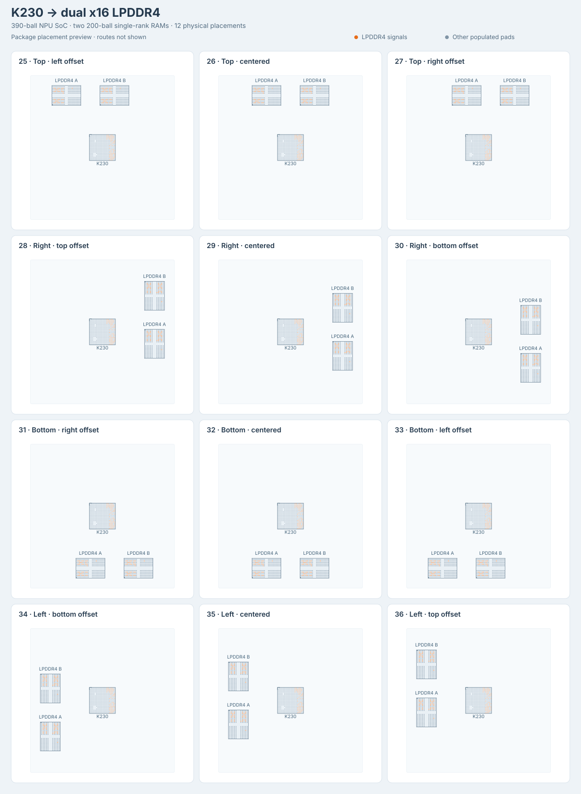

# dataset-fanout31-am62l

Thirty-six TSX-generated BGA fanout problems: twelve AM62L, twelve
Rockchip RK3308-to-DDR3L, and twelve Canaan K230-to-LPDDR4 configurations.
The package name and existing IDs 01-24 remain stable. K230 uses IDs 25-36
and separate exports.

| Sample family | SoC package | Signal connections | Plane drops | Total connections | Buses | Physical pads |
| --- | --- | ---: | ---: | ---: | ---: | ---: |
| AM62L, 01-12 | AM62L32BOGHAANBR, 373 balls | 33 | 102 | 135 | 111 | 573 |
| RK3308, 13-24 | RK3308, 355 balls | 49 | 113 | 162 | 122 | 451 |
| K230, 25-36 | K230, 390 balls | 65 | 106 | 171 | 123 | 790 |

Each family covers all twelve canonical directional edge positions in
`@tscircuit/fanout-solver`:

- majority up: top edge, left/center/right bands
- majority right: right edge, top/center/bottom bands
- majority down: bottom edge, right/center/left bands
- majority left: left edge, bottom/center/top bands

Every problem has a source circuit in `samples/*.tsx` and an independently
selectable `pages/*.page.tsx` React Cosmos fixture.

## Rockchip RK3308 and DDR3L


Regenerate the placement preview with `bun scripts/generate-rk3308-preview.ts`.
The orange pads are DDR signals; routes are not shown in this overview.

The original RK3308 provides an external 16-bit DDR interface in a
355-ball TFBGA package: 13 x 13 mm body, 0.65 mm pitch, and 45 empty sites in
its 20 x 20 ball grid. The complete occupied-ball map is recorded in
[`lib/rk3308-ball-map.ts`](lib/rk3308-ball-map.ts). Coordinates use the top
PCB view, with A1 at the upper left. Package geometry and ball functions
come from the [Rockchip RK3308 datasheet Rev. 1.0](https://dl.radxa.com/rockpis/docs/hw/datasheets/Rockchip%20RK3308%20Datasheet%20V1.0-2018027.pdf),
sections 2.3-2.5, printed pages 16-26. The 106 digital ground balls use
Table 2-1, whose assignments agree with the
[Radxa ROCK Pi S v1.0 schematic](https://dl.radxa.com/rockpis/docs/hw/ROCK-PI-S_v10_sch_20190323.pdf);
the datasheet's Table 2-2 ground summary contains inconsistent ball names.
The RK3308G variant, which embeds RAM, is not used.

RAM is a Samsung `K4B4G1646E-BYMA`: 4 Gb (512 MiB), organized as 256M x16
DDR3L, in a 96-ball FBGA with 0.8 mm pitch and a 7.5 x 13.3 mm body.
Its pinout and dimensions follow the
[Samsung datasheet Rev. 1.0, December 2014](https://files.iczoom.com/hjiczoom/images/public/basicproduct/1476762220150_K4B4G1646E.pdf),
sections 1 and 3.1-3.2, printed pages 5-7. This is a mirror of the
manufacturer-authored datasheet. The package has sixteen rows and six
populated columns (1-3 and 7-9).

All 49 DDR signals connect matching logical functions between the two
packages, without byte or address swaps: 16 data, 2 masks, 4 data strobes,
15 addresses, 3 bank addresses, 2 clocks, and 7 control/reset signals.
They form nine signal buses and three differential pairs. A further 106
`VSS` and 7 `DDR_VDD` balls form single-connection plane-drop buses. All
355 SoC pads and 96 RAM pads remain in the captured obstacle set.

The SoC stays at the origin while the RAM moves physically to each side.
Its center is 18 mm away along the selected axis, with lateral offsets of
-6, 0, or +6 mm for the three bands. RAM rotates 90 degrees for top/bottom
placements and remains at 0 degrees for left/right placements. Its
breakout faces the SoC. These twelve placements are generated by
[`lib/create-rk3308-fanout-sample.tsx`](lib/create-rk3308-fanout-sample.tsx).
The 24-wire address/control bus uses the center band of the selected
edge in every case; the byte and narrower signal buses shift across
the edge bands. Both breakout regions use 3.5 mm padding.

All families use eight layers. RK3308 digital ground drops terminate on
`inner1`, DDR supply drops on `inner2`, and signal routing uses `top`,
`inner4`, `inner5`, `inner6`, and `bottom`. The RK3308 and RAM copper land
diameters are dataset choices of 0.30 mm and 0.40 mm, respectively. These
values describe copper lands; Samsung specifies nominal 0.50 mm solder
balls. The RAM land size follows the
0.8 mm-pitch pattern in the
[KiCad footprint library](https://github.com/KiCad/kicad-footprints/blob/master/Package_BGA.pretty/BGA-96_9.0x13.0mm_Layout2x3x16_P0.8mm.kicad_mod),
while its outline follows the Samsung body dimensions. Length-skew budgets
of 8 mm for each data byte, 15 mm for address/control, and 0.25 mm for each
differential pair are fanout benchmark constraints, not board-level DDR
timing signoff limits.

## Canaan K230 and two LPDDR4 channels



Regenerate the placement preview with `bun scripts/generate-k230-preview.ts`.
The overview shows physical packages and signal pads, without solved routes.

K230 is listed as C21264502 on the
[NPU chip list](https://jlcsearch.tscircuit.com/npu_chips/list). The external-memory
K230 uses a 390-ball VFBGA package: 13 x 13 mm body, 0.65 mm pitch, and ten
empty sites in a 20 x 20 grid. Its complete occupied-ball map and LPDDR4
functions are in [`lib/k230-ball-map.ts`](lib/k230-ball-map.ts), sourced from
Canaan's [pinout workbook v1.2, August 2024](https://kendryte-download.canaan-creative.com/developer/k230/HDK/K230%E7%A1%AC%E4%BB%B6%E6%96%87%E6%A1%A3/K230_PINOUT_V1.2_20240822.xlsx).
Coordinates follow the manufacturer's top view: row A is at the top and
column 1 is on the left; A1 itself is unpopulated. The workbook corrects
DDR descriptions from earlier hardware-guide figures, so the dataset uses
its newer LPDDR4 aliases rather than the LPDDR3 names on the same balls.
The K230D variant with embedded RAM is not used.

Two Micron `MT53E256M16D1FW-046 AIT:B` packages provide one single-rank
x16 LPDDR4 channel each, following the two-device topology in Canaan's
[hardware guide](https://github.com/kendryte/k230_docs/blob/main/en/00_hardware/K230_Hardware_Design_Guide.md#lpddr4).
Each package is 4 Gb (512 MiB), for 1 GiB total, within K230's documented
2 GB maximum in its [datasheet](https://github.com/kendryte/k230_docs/blob/main/zh/00_hardware/K230_datasheet.md#memory).
The density, single-channel organization, complete 200-ball map, and
10 x 14.5 mm package geometry follow Table 3 and Figures 2, 4, and 7 of
the [Micron-authored datasheet, Rev. F, October 2020](https://datasheet.lcsc.com/datasheet/pdf/cafc8b028f5fedc321cc6d079eead257.pdf?productCode=C5330485).
The horizontal and vertical pitches are 0.8 mm and 0.65 mm. These are
signal-compatible fixture choices, without a claim that Canaan qualified
the exact ordering code.

Each channel retains 16 data bits, two masks, four strobe wires, six
command/address bits, one clock pair, CS0, and CKE0. A single SoC `RESET_N`
net connects J16 to T11 on both RAMs. The unused rank-one chip-select and
clock-enable pads remain obstacles. There are no byte or address swaps.
The resulting 65 signal connections form 17 buses and six differential
pairs. Another 101 digital `VSS` and five `VDDIO_DDR` connections form
106 individual plane-drop buses. Every capture retains all 390 SoC pads
and both sets of 200 RAM pads: 171 connections, 123 buses, and 790 obstacles.

The SoC remains at the origin. The RAM pair's center moves 26 mm toward
the selected side and -6, 0, or +6 mm along it; each RAM is another 12 mm
from that center in the transverse direction. Both RAMs rotate 90 degrees
for top/bottom placements and remain unrotated for left/right placements.
These twelve configurations are generated by
[`lib/create-k230-fanout-sample.tsx`](lib/create-k230-fanout-sample.tsx).
The SoC breakout uses 8 mm padding, giving the busiest corner band enough
space for 43 via-safe exits. Each RAM has a separate breakout with 3.5 mm
padding. All three regions remain disjoint, and the shared reset retains
both downstream RAM endpoints. Core supplies the boundary targets; a
multicast reset may omit the optional single-destination target guidance.

K230 signals use `top`, `inner4`, `inner5`, `inner6`, and `bottom` on an
eight-layer board. Digital ground drops terminate on `inner1` and DDR I/O
supply drops on `inner2`. The SoC's 0.30 mm circular copper lands are a
dataset choice; the RAM's 0.40 mm lands follow the SMD board-pad dimension
in Micron's package drawing. These are distinct from solder-ball sizes.
Through vias have 0.24 mm pads and 0.10 mm holes; via-in-pad and blind/buried
vias are disabled. As with the RK3308 fixtures, skew budgets are 8 mm for
data bytes, 15 mm for command/control, and 0.25 mm for differential pairs.
These budgets apply to the fanout benchmark, not board-level timing signoff.

## Fanout fixture scope

The TSX describes actual SoC-to-RAM connectivity and requests boundary
directions through one routed SoC `<breakout>`. A routing-disabled RAM target
boundary gives core's implicit winding solver the opposite endpoint geometry;
it does not instantiate or score a second `FanoutSolver`. The dataset captures
exactly one SoC `FanoutSolver` constructor per case after core places the
`AutoplacedBreakoutPoint`s. Individual breakout-point coordinates are not
supplied by the sample files. Each case is displayed through
`GenericSolverDebugger` in the exported React Cosmos site.

These are SoC escape-routing fixtures. The scored routes end at the SoC
breakout boundary, and board routing between the packages is disabled.
They do not model a complete working board: other SoC interfaces, analog
grounds and supplies, RAM power/reference connections, decoupling, and
termination circuitry are outside this workload.

The AM62L footprint, signal assignments, preferred layers, length-skew
limits, differential pairs, GND/VDDS_DDR plane drops, and plane-drop
directions retain the fixture behind
`tscircuit/core/tests/repros/repro-am62l-lpddr4-progressive-fanout.test.tsx`.
The two DMI buses come from its RAM-above variant, making the original
family a superset of that fixture's default seven-signal-bus test.

## Development

```sh
bun install
bun run start
bun test
bun run typecheck
bun run format:check
bun run build:site
```

`solve-count` reports the measured solver success count with a 60-second
timeout per sample in a family run. With no arguments it runs all 36
samples; use `--chip` to select a family:

```sh
bun run solve-count
bun run solve-count --chip am62l
bun run solve-count --chip rk3308
bun run solve-count --chip k230
bun run solve-count --sample 13-rk3308-top-left-offset
bun run solve-count --sample 25-k230-top-left-offset
```

`FANOUT_SAMPLE_TIMEOUT_MS` overrides the timeout for family runs. A
`--sample` invocation runs directly and returns one JSON result. Legacy
exit selectors such as `--sample topside_left` still select AM62L unless
`--chip rk3308` or `--chip k230` is supplied.
